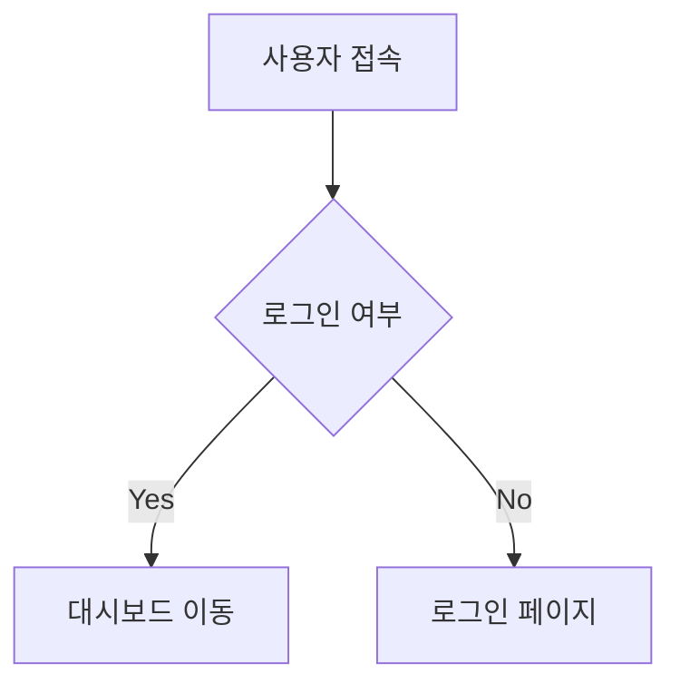

---
# 1. 필수 설정 (이건 꼭 수정하세요)
title: "포스트 예시 템플릿"
date: 2025-12-24 21:50:58 +0900
categories: [Mmarkdown]
tags: [Tip]
description: "포스트 예시 템플릿"

# 2. 고급 설정 (필요할 때만 true 또는 경로 입력)
pin: false                   # true로 설정하면 메인화면 최상단에 고정됨 (공지사항 등)
math: true                   # 수식($$)을 사용할 경우 true
mermaid: true                # 다이어그램(flowchart)을 그릴 경우 true
toc: true                    # 오른쪽 목차 표시 여부 (기본값 true)
comments: false               # 댓글 기능 켜기/끄기

# 3. 이미지/배너 설정
image:
  # 배너 이미지 경로
  path: /assets/img/banners/post-example-banner.jpeg
  alt: post-example-banner # 시각장애인용 설명 (SEO)
---

## 텍스트 강조와 인용 (Text Formatting)

중요한 단어는 **굵게(Bold)** 처리하거나 *기울임(Italic)* 처리할 수 있습니다.
키보드 키는 <kbd>Ctrl</kbd> + <kbd>C</kbd> 처럼 표현합니다.
```Markdown
**굵게(Bold)**, *기울임(Italic)*, <kbd>Ctrl</kbd> + <kbd>C</kbd>
```
<br>

> **인용문(Blockquote):**
> 누군가의 말을 인용하거나, 짧은 요약을 넣을 때 사용합니다.
> 이렇게 여러 줄도 가능합니다.

```Markdown
> **인용문(Blockquote):**
> 누군가의 말을 인용하거나, 짧은 요약을 넣을 때 사용합니다.
> 이렇게 여러 줄도 가능합니다.
```

---
<br><br>

## 1. 개요 (Overview)
> **요약:** 이 글을 쓰게 된 배경이나 문제 상황을 1~2줄로 요약합니다.

## 2. 알림 상자 (Prompts) ⭐ 중요
기술 블로그에서 가장 중요한 **강조 박스**입니다. Chirpy 테마 전용 기능입니다.

> **팁 (Tip)**
> 꿀팁이나 부가 설명을 적을 때 사용합니다. 초록색으로 뜹니다.
{: .prompt-tip }

> **정보 (Info)**
> 참고할 만한 정보를 적을 때 사용합니다. 파란색으로 뜹니다.
{: .prompt-info }

> **주의 (Warning)**
> 실수하기 쉬운 부분을 경고할 때 사용합니다. 노란색으로 뜹니다.
{: .prompt-warning }

> **위험 (Danger)**
> 데이터 삭제 등 치명적인 명령어를 소개할 때 씁니다. 빨간색으로 뜹니다.
{: .prompt-danger }

---

## 3. 코드 블록 심화 (Code Blocks)

### 3-1. 파일 경로 표시 (File Path)
파일명이 무엇인지 알려주는 Chirpy의 멋진 기능입니다.

```yaml
# _config.yml
theme: jekyll-theme-chirpy
lang: ko-KR
```
{: file='_config.yml' }


### 3-2. 코드 비교 (Diff)
어떤 코드를 지우고(-) 추가했는지(+) 보여줄 때 씁니다.

```diff
- server_port: 80
+ server_port: 443
  allowed_ip: 127.0.0.1
```


### 3-3. 터미널 명령어
```Bash
$ sudo apt update
$ sudo apt install docker.io
```

---

## 4. 목록과 체크리스트 (Lists)

**작업 순서 (Ordered List)**
 1. 첫 번째 할 일
 2. 두 번째 할 일
    1. 들여쓰기 된 하위 작업
    2. 하위 작업 2

**체크리스트 (Task List)**
- [x] 완료된 작업 (대괄호 안에 x)
- [ ] 아직 안 한 작업 (대괄호 안에 공백)
- [ ] hwaserbit.com 도메인 연결

---

## 5. 운영체제별 설정 (Tabs) ⭐ 핵심기능
서버 환경별로 다른 명령어를 보여줄 때 사용하세요.





```Bash
# Ubuntu/Debian 계열
sudo apt-get install htop
```



```Bash
# RHEL/CentOS 계열
sudo yum install htop
```





---

## 6. 이미지와 미디어 (Media)
### 이미지 삽입
{: width="300" height="300" .shadow }
_이미지 밑에 들어가는 캡션(설명)입니다_

유튜브 영상 삽입


---

## 7. 고급 기능 (Advanced)
### 7-1. 수식 (MathJax)
수학적 표현이 필요할 때 사용합니다. (Front Matter에 math: true 필수)

$$ E = mc^2 $$

### 7-2. 다이어그램 (Mermaid)
코드만으로 플로우 차트를 그립니다. (Front Matter에 mermaid: true 필수)



### 7-3. 각주 (Footnote)
설명이 필요한 단어 옆에 숫자를 붙입니다.[^1]
[^1]: 1여기에 1각주에 1대한 1보충 1설명을 1적습니다. 1자동으로 글 하단에 배치됩니다.

설명이 필요한 단어 옆에 숫자를 붙입니다.[^2]
[^2]: 여2기에 각2주에 대2한 보2충 설2명을 적2습니다. 자2동으로 글 하단에 배치됩니다.

---

### 8. ✅ 결론 (Conclusion)
작업 결과 및 느낀 점을 기록합니다.
1.  **작업 결과:** `결과` 결과
2.  **느낀점:** `?`를 느낌? 

---


