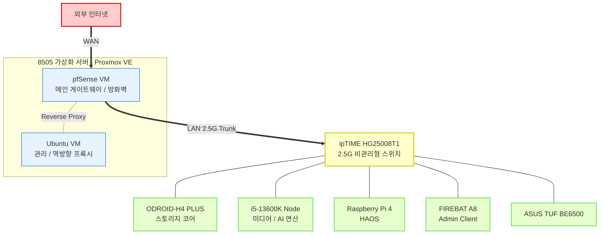

> **TL;DR (요약 로그)**
> 1. 단일 대형 서버에 집중된 모놀리식(Monolithic) 구조를 해체하고, 네트워크 게이트웨이, 데이터 스토리지, AI 연산 노드로 역할을 완벽히 분리한 분산형 인프라를 설계했습니다.
> 2. 스토리지 전담 노드의 저전력화 및 AI 연산 노드의 물리적 분리를 통해, 24시간 무중단 홈랩 운영에 따른 아이들(Idle) 전력 소모를 최적화하고 유지 비용(OPEX)을 최소화했습니다.
> 3. PCIe ReBAR 미지원 등 구형 플랫폼의 하드웨어 병목을 아키텍처 레벨에서 해결하고, Proxmox 기반의 가상화 라우터(pfSense)를 배치하여 내부망 트래픽의 중앙 통제권을 확보했습니다.
{: .prompt-info }

<br>

```bash
root@hwaserbit:~# ip route show && brctl show
```

## 1. 개요 (Background)

24시간 365일 무중단으로 구동되어야 하는 개인 홈랩 인프라 특성상, 엔터프라이즈급 레거시 장비(예: 과거 사용된 HP Z640 워크스테이션 등)가 가지는 높은 아이들(Idle) 전력 소모(평균 65W 이상)는 유지비용 측면에서 심각한 오버헤드를 발생시킵니다. 

또한, 로컬 AI 연산 및 미디어 트랜스코딩을 위해 도입한 **Intel Arc A770 16GB** 그래픽카드의 VRAM 대역폭을 온전히 사용하려면 PCIe의 **ReBAR(Resizable BAR)** 기술이 필수적입니다. 이를 지원하지 않는 구형 플랫폼에서는 GPU 자원을 10~20%밖에 활용하지 못하는 치명적인 병목(Bottleneck)이 발생합니다. 

이러한 전력 비효율성과 I/O 병목 현상을 원천 차단하기 위해, 시스템의 역할을 **[네트워크/가상화], [스토리지], [컴퓨팅/AI]** 세그먼트로 명확히 분리하고 하드웨어 자원을 최적화하는 대규모 아키텍처 설계를 진행했습니다.

## 2. 네트워크 및 아키텍처 토폴로지 (Topology)

인프라의 중심은 Proxmox 하이퍼바이저 위에서 동작하는 **pfSense VM**이 담당합니다. 외부 인터넷 트래픽을 가장 먼저 수신하고, 내부 2.5G L2 스위치를 통해 각 물리적 노드로 패킷을 라우팅하는 구조입니다.



물리적 pfSense 페일오버(Failover) 클러스터링을 구성하여 IPTV 등의 무중단 네트워크를 보장하는 방안을 구상했으나, 현재는 이 역할로써 이용하려던 기기의 불량과 컴퓨터 부품(메모리 등)의 가격상승의 이유로 보류된 상태입니다. 단일 장애점(SPOF)이 존재하지만, 향후 자금 문제가 해결된다면 백업 노드를 구매하거나 Proxmox의 스냅샷 및 시스템 백업 파이프라인을 구축하여 장애 발생 시 복구 시간을 최소화하는 방향으로 리스크를 통제할 계획입니다.

## 3. 서버별 역할 및 하드웨어 명세 (Hardware & Roles)

### 3.1. 메인 게이트웨이 및 가상화 노드 (Pentium Gold 8505 알리구매)
네트워크의 관문이자 관리형 서비스를 구동하는 코어 인프라입니다.
- **OS**: Proxmox VE 8.4.0
- **NIC**: 2.5G LAN × 6 (Intel I226-V)
- **역할 및 설계**: 
  - **pfSense VM (네트워크 격리 및 브릿지 아키텍처)**:
	  - **WAN (물리적 격리)**: 외부와 연결되는 물리적 NIC는 **PCIe 패스스루(Passthrough)** 방식으로 호스트(Proxmox) 운영체제와 완벽히 격리하여 pfSense에 직접 할당했습니다. 이는 외부 인바운드 트래픽이 하이퍼바이저 계층을 거치지 않고, 오직 최전방 라우터(방화벽) 단에서만 엄격한 접근 제어(ACL) 및 패킷 필터링을 거치도록 강제하는 Zero-Trust 관점의 보안 설계입니다.
	  - **LAN (논리적 브릿지)**: 반면 내부망(LAN) 영역은 Proxmox에서 생성한 **가상 브릿지(Linux Bridge)**와 **가상 NIC(VirtIO)**를 연동하는 방식을 채택했습니다. 이를 통해 내부망에서 Proxmox 호스트(Web UI/SSH)로의 관리용 접근성을 유연하게 확보하는 동시에, 가상 머신 간의 내부 통신(East-West 트래픽) 라우팅 효율을 극대화했습니다.
  - **Ubuntu VM**: 클러스터 외부의 HTTP/HTTPS 요청을 내부 서비스로 매핑하는 인그레스(Ingress) 역할을 수행합니다. 내부망에 Nginx 역방향 프록시를 구축하여 각 노드의 포트를 도메인 기반으로 라우팅하며, 인프라 관리를 위한 중앙 집중식 컨테이너(Portainer 등)를 호스팅합니다.

### 3.2. 스토리지 코어 서버 (Hardkernel ODROID-H4 PLUS)
전력 대비 성능비(전성비)를 극대화한 고효율 데이터 허브입니다.
- **CPU**: Intel Processor N97 (12W TDP)
- **디스크**: 2TB NVMe (OS) + 4TB / 14TB / 16TB HDD
- **역할 및 설계**:
  - N100 대비 높은 클럭(최대 1.6GHz)과 성능을 보여주며, 아이들 전력을 획기적으로 낮췄습니다. 국내 제조사(Hardkernel) 보드 특유의 폼팩터 이점과 안정성을 기반으로 대용량 파일 서버(SMB/NFS) 역할을 전담합니다.
  - ZFS 파일 시스템 도입을 검토했으나, 기존 수십 테라바이트에 달하는 데이터의 마이그레이션 리스크를 고려하여 현재는 검증된 **ext4** 파일 시스템을 채택하여 운용 중입니다.

### 3.3. 연산 및 미디어 컴퓨팅 노드 (i5-13600K)
로컬 AI 추론 및 미디어 하드웨어 가속을 전담하는 고성능 노드입니다.
- **CPU & RAM**: Intel i5-13600K / 64GB DDR4
- **GPU**: Intel Arc A770 16GB
- **역할 및 설계**:
  - 메인보드 BIOS 레벨에서 ReBAR를 활성화하여 A770의 16GB VRAM 병목을 완전히 해소했습니다. 
  - Jellyfin의 미디어 트랜스코딩과 Ollama 기반의 로컬 LLM 컨테이너를 구동합니다. GPU 디바이스는 `/dev/dri/by-path/...-render` 형태의 고정 심볼릭 링크를 사용하여 컨테이너에 패스스루함으로써 재부팅 시에도 매핑이 꼬이지 않도록 아키텍처를 고정했습니다.
  - 대용량 원본 파일은 스토리지 서버(H4-Plus)에서 **NFSv4** 프로토콜로 마운트하여 읽어오며, 트랜스코딩 임시 캐시와 Docker 작업 공간은 로컬 NVMe SSD(`/mnt/work`)로 분리하여 I/O 부하를 분산하고 루트 파티션을 보호합니다.

### 3.4. 홈 IoT (Raspberry Pi 4 8GB)
물리적으로 완전히 독립된 환경에서 구동되는 인프라 제어 및 모니터링 노드입니다.
- **OS**: HAOS (Home Assistant OS)
- **역할 및 설계**: 서버 노드들의 상태와 종속되지 않는 독립적인 전원/네트워크 관리를 위해 구축했습니다. Node-RED, MQTT 애드온을 통해 자택내 IoT 센서와 서버 인프라, 태양광 모니터링 연결하는 미들웨어 역할을 수행합니다.

> **[Troubleshooting] Docker 컨테이너에서 HAOS(Raspberry Pi 4)로 회귀한 아키텍처적 이유**
> 초기에는 8505 Ubuntu VM 내에서 Docker 브릿지 네트워크를 활용해 Home Assistant(HA)를 배포했습니다. 하지만 운영 과정에서 컨테이너 격리 환경이 가지는 명확한 네트워크 한계에 직면하여 물리적 HAOS 환경으로 전면 재구축을 단행했습니다.
> 
> 1. **Auto-Discovery 프로토콜의 단절 및 우회책의 한계**: 브릿지 네트워크의 물리적 격리 특성상, mDNS 및 브로드캐스트 패킷 기반의 자택내 기기 자동 탐색(Auto-Discovery)이 원천 차단됩니다. Docker의 Host Network 모드로 매핑하여 패킷 단절을 우회하는 방안을 고려할 수 있으나, 이는 컨테이너 배포의 핵심인 네트워크 격리(Isolation) 이점을 완전히 훼손하며, 호스트 포트 충돌 및 방화벽 제어권의 복잡성만 가중시키므로 시스템 아키텍처 관점에서 완전히 배제했습니다.
> 2. **Ingress 라우팅 부재 및 Add-on 통합 실패**: 가장 치명적인 결함은 내장 Ingress의 부재였습니다. 외부망에서 리버스 프록시를 통해 HA 대시보드에 접근할 경우, 내부망에서는 정상 작동하던 사이드바 연동 애드온(별도 컨테이너)들로 트래픽 라우팅이 단절되어 시스템 제어권이 반쪽짜리가 되는 문제가 발생했습니다. Nginx를 활용해 각 애드온 컨테이너에 대한 리버스 프록시 룰셋을 수동으로 매핑하여 자체적인 Ingress를 구현하는 것은 기술적으로 가능합니다. 하지만 이러한 커스텀 구성은 향후 유지보수 및 운영 복잡도(Operational Complexity)를 불필요하게 가중시킵니다. 이미 HAOS 생태계에서 완벽하게 제공하는 내장 인그레스 컨트롤러를 두고, 마치 바퀴를 재발명(Reinventing the wheel)하는 것처럼 귀중한 엔지니어링 리소스를 낭비할 이유가 없으므로, 다양한 트러블슈팅 경우의 수를 검토한 끝에 해당 커스텀 구성을 배제하는 것이 아키텍처 관점에서 가장 합리적이라고 판단했습니다.
> 3. **물리적 노드 독립(Decoupling)과 HAOS의 당위성**: Home Assistant 진영에서 기존의 독립적인 Supervisor 설치 방식을 사실상 폐기하고, 전용 OS(HAOS) 환경을 강제하는 엔지니어링적 명분을 명확히 체감했습니다. 다양한 범용 리눅스 환경에서 발생하는 패키지 충돌 및 종속성(Dependency Hell) 문제를 원천 차단하기 위한 구조적 결단이었던 것입니다. 현재 운용 중인 8505 가상화 노드의 한정된 가용 리소스를 고려할 때 억지로 VM을 추가 할당하는 것은 비효율적이라 판단했습니다. 이에 네트워크 인그레스 라우팅과 하드웨어 제어권을 완벽하게 보장받기 위해, Raspberry Pi 4를 HAOS 전용 베어메탈 컨트롤러로 완전히 독립시키는 분산 아키텍처를 채택했습니다.
### 3.5. 관리용 윈도우 클라이언트 (FIREBAT A8 8845HS)
인프라 내부망 관리 및 단순 클라이언트 단말 역할을 수행하는 미니 PC입니다.
- **OS**: Windows 11 Pro (Clean Install)
- **CPU**: AMD Ryzen 7 8845HS
- **역할 및 설계**: 
  - 서버랙 근처에 배치하여 물리적 유지보수 및 프린트, 웹 서핑을 위한 관리용 터미널로 운용합니다. 메인 작업은 분리된 환경(MacBook)에서 WireGuard VPN을 통해 수행하므로, 해당 기기의 네트워크 권한은 최소한으로 격리되어 있습니다.

> **보안 위협 통제 (Risk Management)**
> 해당 중국산 미니 PC 라인업은 출고 단계에서 OS 악성코드가 삽입되거나 BIOS 레벨의 백도어가 존재한다는 공급망 공격(Supply Chain Attack) 리스크가 꾸준히 제기된 바 있습니다. 하지만 시스템 아키텍처 관점에서 해당 위협은 완벽하게 통제되고 있습니다.
> 
> 1. **OS 초기화 및 격리**: 기기 도입 즉시 디스크 파티션을 로우레벨 수준으로 초기화하고 OS를 클린 설치하여 소프트웨어 계층의 위협을 1차적으로 제거했습니다.
> 2. **데이터 비종속성(Stateless)**: 해당 클라이언트 로컬 디스크에는 어떠한 민감 정보도 보관하지 않습니다. 모든 핵심 데이터는 클라우드로 실시간 백업되며, 향후 스토리지 코어(H4-Plus)와 연동되는 자동화된 로컬 증분 백업 파이프라인을 탑재할 예정이므로 단말이 침해당하더라도 데이터 가용성(Availability)에는 전혀 타격을 주지 않습니다.

## 4. 결론 (Conclusion)

모든 서비스를 단일 대형 서버(Z640)에 집약하던 기존의 모놀리식(Monolithic) 하드웨어 구조를 지양하고, 트래픽 라우팅, 데이터 스토리지, GPU 가속 연산의 물리적 역할을 완벽히 분리한 **분산형 인프라(Distributed Infrastructure)**로 설계를 완료했습니다.

Arc A770의 도입과 ReBAR 최적화를 통해 로컬 AI 컴퓨팅 기반을 성공적으로 마련했으며, ODROID-H4 PLUS로 스토리지의 와트당 성능비(Power Efficiency)를 극대화하여 24시간 운영에 따른 유지 비용의 비효율성을 근본적으로 해결했습니다. 향후에는 물리적 백업 라우터(pfSense) 환경을 도입하여 네트워크 고가용성(HA)을 확보하고, 현재 과제로 남아있는 분산 노드 간의 데이터 동기화 및 백업 파이프라인을 현실적인 수준에서 점진적으로 설계하여 시스템의 신뢰성을 확보해 나갈 계획입니다.

```bash
root@hwaserbit:~# uptime -p
up 4 days, 19 minutes
root@hwaserbit:~# exit
```