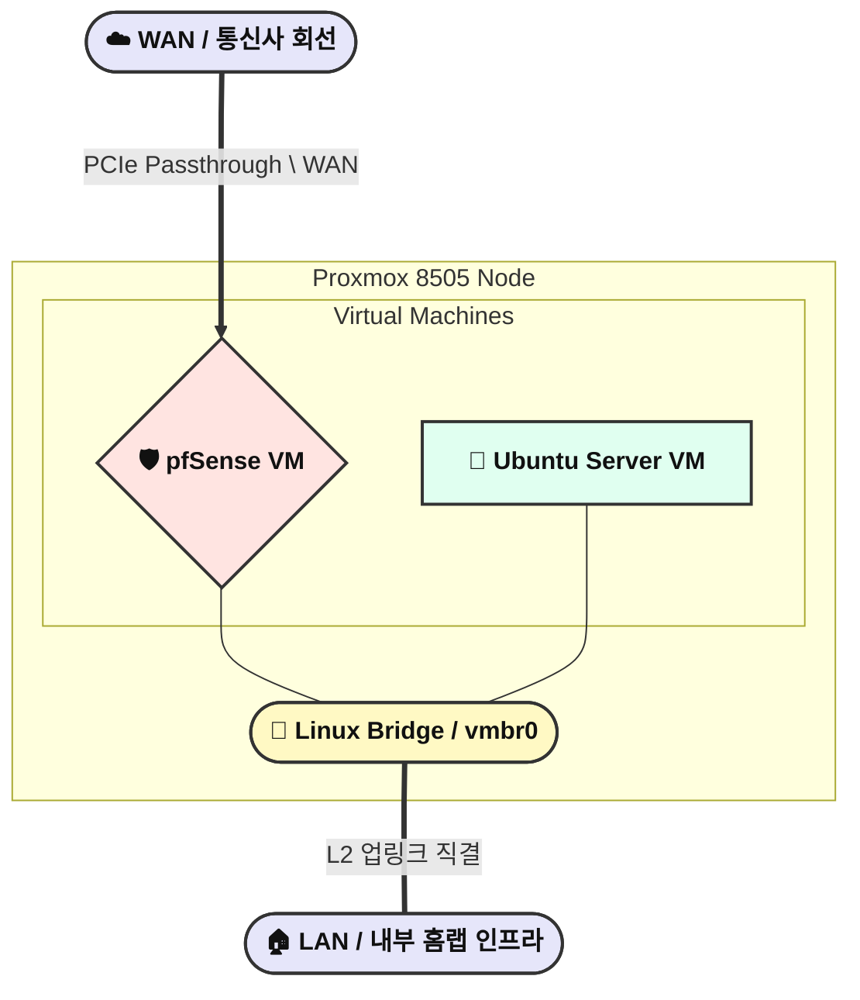

> TL;DR (요약 로그)
>
> * 통신사 라우터의 폐쇄적인 정책(포트 제한, VLAN 불가)을 극복하고, 로컬 인프라의 완벽한 통제권을 확보하기 위해 커스텀 게이트웨이를 직접 설계했습니다.
> * 24시간 365일 구동되는 인프라 특성을 고려해, 단순 E-core 구성(N100)을 배제하고 P/E 하이브리드 아키텍처인 인텔 8505 하드웨어를 채택했습니다.
> * 베어메탈이 아닌 Proxmox 하이퍼바이저를 통해 pfSense와 Ubuntu Server(Ingress)를 논리적으로 분리하여 유연성과 롤백 안정성을 확보했습니다.
{: .prompt-info }

<br>

```bash
root@hwaserbit:~# lspci | grep -i ethernet
03:00.0 Ethernet controller: Intel Corporation Ethernet Controller I226-V (rev 04)
04:00.0 Ethernet controller: Intel Corporation Ethernet Controller I226-V (rev 04)
05:00.0 Ethernet controller: Intel Corporation Ethernet Controller I226-V (rev 04)
06:00.0 Ethernet controller: Intel Corporation Ethernet Controller I226-V (rev 04)
07:00.0 Ethernet controller: Intel Corporation Ethernet Controller I226-V (rev 04)
08:00.0 Ethernet controller: Intel Corporation Ethernet Controller I226-V (rev 04)
```

## 1. 통신사 공유기의 한계와 엔터프라이즈 게이트웨이의 필요성

홈 인프라를 운영하는 엔지니어에게 네트워크의 최상단(Edge)을 제어하는 게이트웨이는 전체 시스템의 안정성과 보안을 결정짓는 가장 핵심적인 인프라입니다. 초창기에는 ISP(통신사)에서 제공하는 기성품 공유기에 의존했으나, 시스템 규모가 커질수록 블랙박스 형태의 장비가 가지는 치명적인 한계점들이 드러났습니다.

과거 사용했던 SK 비대칭형 동축 케이블 환경에서는 업로드 대역폭의 병목 현상과 기성품 공유기의 간헐적인 세션 다운이 발생했습니다. 다운된 공유기는 자동 재부팅과 원격접근 조차 불가능한 상태로 굳어버려 인프라의 가용성을 심각하게 훼손했습니다. 이후 KT 광랜으로 이전하며 회선의 물리적 안정성은 확보했으나, 주요 서비스 포트(Well-Known Port, 예: 80, 443 등) 차단, 포트 포워딩 룰 및 내부 고정 IP 설정 개수 제한, 그리고 관리자 권한 통제 등 통신사 고유의 폐쇄적인 정책으로 인해 세밀한 방화벽 룰셋 적용이 불가능에 가까웠습니다. 

최근 회선을 LG로 변경하면서 ISP 단에서 기본적으로 IPv6를 할당하는 흥미로운 망 구조 변화를 확인했습니다. 제공된 기본 라우터를 분석해본 결과, IPv4/IPv6 듀얼 스택(Dual Stack) 제어 등 타 통신사 대비 유연한 설정 인터페이스를 제공한다는 점은 인상적이었습니다.

그러나 Root 권한(최고 관리자 권한)이 원천적으로 차단된 블랙박스 장비라는 본질은 변하지 않습니다. 인프라 내부의 정적 라우팅 테이블 제어, L2/L3 수준의 완벽한 네트워크 격리(VLAN), 그리고 커스텀 방화벽 룰셋을 수립하기에는 여전히 한계가 명확했습니다. 결국 예측 불가능한 통신사 정책에서 벗어나 로컬 환경의 통제권을 100% 확보하기 위해서는, 엔터프라이즈급 패킷 처리와 보안 정책 수립이 가능한 '전용 라우터'의 직접 구축이 필수적이라고 판단했습니다.

---

## 2. 하드웨어 선정 및 8505 아키텍처 분석

가정집이라는 물리적 환경에서 24시간 365일 무중단으로 동작해야 하는 장비의 최우선 조건은 **전력 소비(전성비)**와 **발열 제어**입니다. 

초기에는 기존 통신사 공유기를 핵심 라우터로 그대로 유지한 채, 전력 소모가 적은 라즈베리 파이(Raspberry Pi)를 내부망에 덧붙여 DHCP 할당 및 Pi-hole(또는 AdGuard Home)을 통한 DNS 싱크홀 전용 서버로 구성하는 우회적인 제어 방안을 고려했습니다.

하지만 물리적인 이더넷 포트가 1개뿐인 라즈베리 파이는 WAN과 LAN을 직접 분리하는 인라인(In-line) 게이트웨이로 사용할 수 없습니다. 무엇보다 이러한 타협안은 내부망의 광고 차단 정도는 가능할지라도, 가장 핵심적인 L3 라우팅과 방화벽 정책은 결국 통신사의 폐쇄적인 장비에 계속 의존해야 한다는 본질적인 한계가 존재했습니다.

"단순히 DNS 우회를 하는 수준이 아니라, 라우팅부터 엔터프라이즈급 방화벽까지 아예 인프라 전체의 통제권을 하나의 장비로 완벽하게 통합할 수 없을까?"라는 고민 끝에 **pfSense**의 도입을 결정했습니다. x86 아키텍처 기반의 pfSense를 구동하고 2.5Gbps 트래픽을 병목 없이 처리하기 위해서는 ARM 기반의 단일 포트 SBC가 아닌, 다중 물리 랜포트를 갖춘 제대로 된 라우터 폼팩터가 필요했습니다.

최종적으로 알리익스프레스 등에서 공급망이 형성된 6개의 2.5G 랜포트(Intel I226-V)를 탑재한 미니 PC 폼팩터를 선정했습니다. 이 과정에서 가장 치열하게 고민했던 부분은 바로 시스템을 구동할 CPU 아키텍처의 선택이었습니다.

### N100 vs 인텔 8505 프로세서 비교

시장에는 전력 소모가 극도로 적은 N100(E-core 4개) 기반 라우터가 주류를 이루고 있었습니다. 하지만 인프라 엔지니어로서 트래픽 처리의 구조적 특성을 고려할 때, N100은 한계가 명확했습니다.
네트워크 패킷은 평시에는 부하가 적지만, WireGuard VPN 암호화 · 복호화 작업이나 향후 도입할 IDS/IPS(침입 탐지/방지 시스템)의 패킷 심층 분석(DPI) 시 순간적인 연산 스파이크(Spike)가 발생합니다.

* **성능 병목 회피:** 인텔 펜티엄 골드 8505는 1개의 P-core와 4개의 E-core로 구성된 하이브리드 아키텍처입니다. 평시(Idle)에는 E-core를 활용하여 전성비를 극대화하고, 트래픽이 몰리거나 무거운 연산이 필요할 때는 P-core가 개입하여 레이턴시 지연을 방지합니다. 
* **보안 가속 및 가상화:** `AES-NI` 하드웨어 가속을 완벽히 지원하여 VPN 트래픽 처리 효율이 뛰어나며, `VT-d` 지원을 통해 후술할 하이퍼바이저 환경에서 물리 NIC의 PCIe Passthrough 설정이 매우 용이합니다.

---

## 3. Proxmox 하이퍼바이저 도입 및 가상화 설계

초기에는 하드웨어 리소스를 100% 라우팅에만 집중하기 위해 pfSense를 네이티브 베어메탈로 설치하는 방안을 고려했습니다. 하지만 최종적으로 물리 서버 위에 Proxmox VE를 올리고, 그 위에 가상 머신(VM) 형태로 pfSense와 리눅스 서버를 구성하는 아키텍처를 설계했습니다.

### 베어메탈 대신 Proxmox를 선택한 이유 

1. **스냅샷 기반의 장애 복원력 (향후 고도화 목표):** 네트워크 게이트웨이의 설정 오류는 전체 인프라의 단절을 의미합니다. Proxmox의 스냅샷 기능을 활용하면 룰셋 적용 전 상태를 저장해두고 즉각적인 하드 롤백(Hard Rollback)이 가능하다는 점이 가상화 도입의 핵심적인 매력이었습니다. 다만 현재는 코어망 구축 자체에 자원을 집중하고 있어 해당 백업 파이프라인까지 완벽하게 구현하지는 못했습니다. 이는 향후 게이트웨이 운영 안정성을 극대화하기 위해 최우선으로 학습하고 시스템에 도입할 과제입니다.
2. **역할의 논리적 분리 (Decoupling):** 하드웨어 리소스에 여유가 있으므로, 코어 라우팅과 방화벽 기능은 pfSense VM에 전담시켰습니다. 인그레스(Ingress) 계층의 경우 pfSense 내장 패키지(HAProxy)를 활용할 수도 있지만, 인프라 구축의 신속성과 간소화를 위해 기존에 숙련된 Nginx 리버스 프록시 방식을 유지하기로 결정했습니다. 이를 위해 별도의 Ubuntu Server VM을 띄워 Nginx와 Cloudflare Tunnel 에이전트를 구성함으로써, 외부 노출 프록시 역할을 내부 방화벽망과 완벽하게 격리했습니다.

> 순수 Ubuntu Server 환경에서 KVM/QEMU를 구축해 CLI 환경으로 가상 머신을 띄우는 방식도 동일 선상에서 검토했습니다. 그러나 네트워크 가상 브리지 구성과 PCIe 매핑을 오직 터미널 명령어로만 관리하는 것은 유지보수 피로도가 높고 직관성이 크게 떨어진다고 판단했습니다. Proxmox는 동일한 KVM을 기반으로 하면서도, 복잡한 인프라 토폴로지를 직관적인 웹 GUI로 완벽하게 통제할 수 있어 불필요한 관리 소요를 원천 차단해 주는 최적의 선택지였습니다.
{: .prompt-tip }

### 논리적 네트워크 토폴로지 시각화 



설계된 아키텍처에서 외부 WAN 회선은 Proxmox 단에서 호스트 OS를 거치지 않고 IOMMU를 통해 pfSense VM으로 **PCIe Passthrough** 처리됩니다. 이를 통해 가상화 오버헤드를 제로(0)로 만들고 보안 공격 표면을 최소화했습니다. pfSense에서 NAT 처리된 트래픽은 내부 가상 브리지를 통해 Ubuntu VM의 Nginx Ingress로 전달되어 각 내부 서비스로 역방향 프록시(Reverse Proxy) 됩니다.

### OS 전력 최적화 배제와 가용성(Availability) 우선 설계

초기 설계 단계에서는 Proxmox 호스트 레벨에서 `powertop` 데몬을 구동하거나, 커널 파라미터에 `pcie_aspm=force`를 주입하여 PCIe 장치(NIC 등)의 유휴 전력을 극한으로 낮추는 최적화를 고려했습니다. 

하지만 인프라 엔지니어링 관점에서 네트워크 게이트웨이의 최우선 가치는 **'무중단 가용성(High Availability)'**입니다. 수 밀리초(ms) 단위로 끊임없이 패킷이 오가는 라우터 환경에서 강제 절전 세팅을 적용할 경우, 다음과 같은 치명적인 아키텍처 리스크가 예상되었습니다.

* **Wake-up Latency와 링크 플래핑(Link Flapping):** 물리적인 2.5G 랜카드(Intel i226-V)가 절전 상태(L1)에서 활성 상태(L0)로 깨어날 때 필연적으로 **지연 시간(Latency)**이 발생하며, 이는 곧 **미세한 패킷 로스**나 **일시적인 세션 단절**로 이어집니다.
* **PCIe Passthrough 제어권 충돌:** 하이퍼바이저(Proxmox)가 IOMMU를 통해 pfSense VM에 랜포트 제어권을 완전히 넘긴 상태입니다. 이때 호스트 OS가 강제로 물리 장치의 절전 모드에 개입하게 되면, 가상 머신과의 하드웨어 **인터럽트 충돌**이나 **심각한 커널 패닉**을 유발할 수 있습니다.

결과적으로 단 몇 와트(W)의 대기 전력을 추가로 절약하기 위해, 인프라 전체의 네트워크 안정성을 위협하는 **오버 엔지니어링**은 배제하기로 했습니다. 

인위적인 OS 단의 절전 튜닝을 강제하는 대신, 트래픽 부하에 따라 P코어와 E코어가 유연하게 동작하여 스스로 전성비를 끌어올리는 **인텔 8505 하이브리드 아키텍처 고유의 전력 관리 메커니즘**에 시스템을 맡기기로 최종 결정했습니다.

---

## 4. 결론 (Conclusion)

안정적인 홈랩 운영을 위해 통신사 제공 공유기를 폐기하고, 인텔 8505 하드웨어와 Proxmox 기반의 독립적인 네트워크 게이트웨이를 성공적으로 구축했습니다. P-core와 E-core의 조합은 가정집이라는 제한된 환경에서 필수적인 '전성비'를 만족시킴과 동시에, 2.5Gbps 대역폭 제어와 VPN 암호화 처리라는 두 마리 토끼를 모두 잡는 최적의 하드웨어 스펙임을 증명했습니다. 

또한, pfSense와 Ubuntu Server를 가상 머신으로 분리하는 설계를 통해, 하나의 장비 안에서 네트워크 코어 라우팅과 인그레스 웹 프록싱 역할을 충돌 없이 수행할 수 있는 논리적 기반을 마련했습니다. 당장 복잡한 IDS/IPS 시스템을 활성화하지 않더라도, 인프라의 확장에 대비한 강력한 뼈대가 완성된 것입니다.

하드웨어와 하이퍼바이저 수준의 뼈대 설계가 완료되었으므로, 이어지는 시리즈에서는 논리적 네트워크망 구축에 집중합니다. 

다음 글에서는 IOMMU 기반의 **PCIe Passthrough(물리 인터페이스 직접 할당)** 설정 과정과, 라우터 VM 장애 시에도 호스트 제어권을 보장하는 **Out-of-Band(관리망 분리)** 등 인프라 가용성 확보를 위한 핵심 아키텍처 구현을 중점적으로 다루겠습니다.

```bash
root@hwaserbit:~# uptime -p
up 6 days, 48 minutes
root@hwaserbit:~# reboot
```