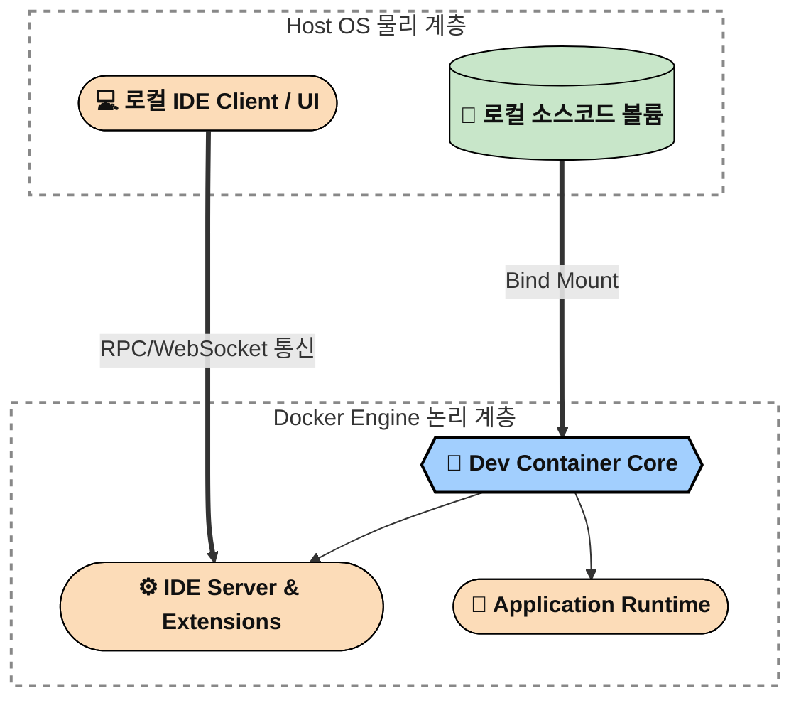

> **TL;DR (요약 로그)**
> 
> 1. 애플리케이션 코드 변경 시 발생하는 Docker 이미지 리빌드(Rebuild) 대기 시간으로 인해 개발 생산성에 심각한 병목 현상이 발생했습니다.
> 2. 호스트 볼륨 마운트와 컨테이너 내부 실행을 결합한 하이브리드 환경을 1차 고안했으나, 의존성 관리의 복잡도 증가 및 비재현성(Non-reproducibility)의 한계를 확인했습니다.
> 3. 코드(Host)와 환경(Container), IDE 프로세스를 논리적으로 완벽히 격리하는 Dev Container 아키텍처를 도입하여 인프라의 재현성과 개발 속도를 동시에 확보했습니다.
{: .prompt-info }

<br>

```bash
root@hwaserbit:~# systemctl status devcontainer-workspace.service
● devcontainer-workspace.service - Docker Dev Environment Isolation
     Loaded: loaded (/etc/systemd/system/devcontainer-workspace.service; enabled; vendor preset: enabled)
     Active: active (running) since Sat 2026-04-11 23:23:00 KST; 1min 12s ago
```
{: .nolineno }

## 컨테이너 환경의 딜레마: 불변성과 개발 생산성의 충돌

현대적인 시스템 엔지니어링 및 애플리케이션 배포 파이프라인에서 컨테이너 기술은 선택이 아닌 필수입니다. 초기에는 `docker-compose`를 활용하여 완성도 높은 오픈소스 프로젝트나 이미 구축된 이미지를 결합해 환경을 구성했습니다. 하지만 시스템의 복잡도가 올라가고, 비즈니스 로직과 인프라 설정이 요구사항과 엇갈리기 시작하면서 완전한 제어권을 확보하기 위해 일부 커스텀 `Dockerfile`을 직접 작성하고 튜닝하는 단계로 진입했습니다.

컨테이너 기반 개발의 가장 큰 무기는 **'환경의 불변성(Immutability)'**과 **'재현성(Reproducibility)'**입니다. 로컬 호스트의 패키지 의존성에 오염되지 않고, 격리된 런타임 환경을 보장합니다. 

그러나 이 불변성은 로컬 개발(Development) 단계에서 **Docker 레이어 캐싱(Layer Caching) 아키텍처의 구조적 한계**와 맞물려 치명적인 병목(Bottleneck)을 유발했습니다. 코드를 수정할 경우, 소스 코드를 포함하는 COPY 레이어에서 캐시 무효화(Cache Miss)가 발생하며 해당 레이어 이후 단계의 재빌드가 필요합니다. Docker의 레이어 캐싱 전략을 통해 일부 단계는 재사용될 수 있으나, 애플리케이션 코드 변경이 잦은 개발 단계에서는 반복적인 rebuild 가 발생하여 시간 지연이 발생합니다.

명령어 배치 순서를 통해 캐싱을 최적화할 수는 있으나, 애플리케이션 코드 변경이 빈번한 개발 단계에서는 여전히 이미지 재패키징과 프로세스 스핀업(Spin-up)에 따른 대기 시간이 반복적으로 발생합니다.

---

## 기존 개발 환경 아키텍처의 구조적 한계 분석

개발과 배포(운영) 환경이 명확히 분리되지 않은 상태에서 컨테이너를 개발 환경으로 활용할 때 발생하는 문제는 크게 두 가지 양상으로 나타났습니다.

### 1. Dockerfile 기반의 빌드 반복 모델 
{: data-toc-skip='' .mt-4 }
가장 정석적인 접근입니다. 애플리케이션 소스 코드 자체를 `COPY` 명령어를 통해 이미지 내부로 밀어 넣고 런타임을 구성합니다.
* **장점:** 설정된 환경과 소스 코드가 하나의 단위로 묶이므로 재현성이 100% 보장됩니다. 배포 시에도 동일한 동작을 확신할 수 있습니다.
* **단점:** 단 한 줄의 오타를 수정하더라도 기존 컨테이너를 파기하고 리빌드해야 합니다. 빌드 프로세스 자체가 개발 속도의 상한선을 결정짓는 치명적인 오버헤드로 작용합니다.

### 2. 컨테이너 내부 직접 수정 (Exec Injection) 모델 
{: data-toc-skip='' .mt-4 }
빌드 대기 시간을 우회하기 위해 쉘로 컨테이너에 진입(`docker exec -it ...`)하여 코드를 직접 수정하거나 의존성을 설치하는 방식입니다.
* **장점:** 코드가 즉각적으로 반영되어 테스트 속도가 비약적으로 상승합니다.
* **단점:** 인프라 통제 관점에서는 지속 가능한 워크플로우로 부적합한 안티 패턴(Anti-Pattern)에 가깝습니다. 컨테이너 내부에서 발생한 상태 변화가 이미지 레이어에 반영되지 않아(비재현성), 컨테이너가 재시작되거나 파기될 경우 모든 수정 사항이 증발합니다. 추후 `Dockerfile`에 환경을 반영할 때, 개발자가 수동으로 입력했던 명령어들을 누락하는 휴먼 에러(Human Error)가 필연적으로 발생합니다.

### 3. 하이브리드 아키텍처의 한계 
{: data-toc-skip='' .mt-4 }
위 두 방식의 트레이드오프를 해결하기 위해 1차적으로 고안한 방법은 '하이브리드 바인드 마운트(Hybrid Bind Mount)'였습니다. 
운영체제 기반 패키지와 핵심 의존성(라이브러리 등)은 `Dockerfile`에 선언하여 빌드하고, 자주 변경되는 소스 코드가 위치한 디렉터리(예: `/app` {: .filepath })는 호스트 머신과 볼륨으로 연결하는 방식입니다. 

이 방식은 프로세스나 컨테이너의 단순 재시작만으로 코드 변경분을 반영할 수 있어 빌드 대기 시간을 획기적으로 줄였습니다. 하지만 프로젝트가 고도화되면서 패키지 매니저(npm, pip 등)를 통한 의존성 추가가 잦아졌고, 결국 `Dockerfile`을 다시 수정하고 리빌드해야 하는 근본적인 굴레를 벗어나지 못했습니다. 이는 개발 환경 아키텍처가 배포 아키텍처에 종속되어 발생한 구조적 모순이었습니다.

> **💡 설계적 통찰**
> 이 문제를 겪으며 기존에 사용하던 컨테이너 방식은 철저히 **'배포(Deployment)'**에 초점이 맞춰져 있음을 깨달았습니다. 개발 시점의 유연성과 배포 시점의 불변성을 동시에 만족하는 아키텍처가 필요했습니다.
{: .prompt-tip }

---

## Dev Container 도입: 환경, 코드, IDE의 완벽한 디커플링

기존의 임시방편적인 우회책(Workaround)으로는 근본적인 생산성 저하를 해결할 수 없다고 판단했습니다. 마침 학부 오픈소스 소프트웨어 강의를 통해 **Dev Container(Development Containers)**라는 개념을 접하게 되었고, 이를 분석한 결과 제가 고민하던 '환경과 코드의 분리'를 아키텍처 레벨에서 가장 우아하게 구현할 수 있는 해답임을 확신했습니다. 이에 따라 코드, 실행 환경, 그리고 IDE 자체를 논리적으로 완전히 분리하는 설계를 제 시스템에 적용하기로 결정했습니다.

Dev Container의 핵심 철학은 다음과 같습니다.
* **Environment = Docker Image:** 프로젝트에 필요한 런타임, 언어, 도구 체인은 컨테이너 이미지로 고정합니다.
* **Code = Host Volume Mount:** 소스 코드는 호스트 파일 시스템에 존재하며 컨테이너로 실시간 바인드 마운트됩니다.
* **IDE = Containerized Server:** IDE의 UI(클라이언트)는 로컬 호스트에 남겨두고, 코드 분석, 디버깅, 실행을 포함한 주요 개발 실행 컨텍스트를 컨테이너 내부로 이동시켜 동작시킵니다.

또한 Dev Container에서 사용하는 베이스 이미지를 배포용 이미지와 최대한 공유함으로써, 개발 환경과 운영 환경 간의 drift를 최소화했습니다.

### 아키텍처 시각화 
{: data-toc-skip='' .mt-4 }



물리적으로는 SSH 터널링을 통해 보안과 연결성을 확보하고, 그 내부에서는 IDE의 UI와 서버 엔진이 WebSocket/RPC 기반으로 실시간 데이터를 교환하도록 설계하여 로컬과 다름없는 심리스(Seamless)한 개발 환경을 구축했습니다.

### 프로젝트 디렉터리 설계 및 역할 분리 
{: data-toc-skip='' .mt-4 }

이러한 사상을 반영하기 위해 프로젝트 루트 디렉터리에 `.devcontainer`{: .filepath } 디렉터리를 구성하여 인프라 설정 파일들을 역할별로 격리했습니다.

```text
project-root/
├── .devcontainer/
│   ├── devcontainer.json      # 개발 환경 특화 설정 (VS Code 확장프로그램, 포트 포워딩, 유저 권한)
│   └── Dockerfile             # 컨테이너 베이스 OS 및 코어 패키지 (개발용)
├── docker-compose.yml         # 외부 인프라 서비스 (DB, Redis, Ingress Proxy)
├── Dockerfile.prod            # 운영 배포용 불변(Immutable) 이미지 빌드 파일
└── src/                       # 비즈니스 로직 소스 코드
```
{: .nolineno }

* **`Dockerfile`의 분리:** 개발용 도구(curl, git, 디버거 등)가 포함된 개발용 이미지와 오직 바이너리만 포함된 배포용(`Dockerfile.prod`) 이미지를 분리하여, 배포 시 컨테이너의 공격 표면(Attack Surface)을 최소화했습니다.
* **`devcontainer.json`:** 어떤 IDE 확장을 컨테이너 쪽에 설치할 것인지, 호스트의 어느 포트와 맵핑할 것인지 정의하는 선언적 환경 파일입니다. 이를 통해 새로운 팀원이 합류하더라도 로컬에 특정 버전의 Python이나 Node.js를 설치할 필요 없이 즉시 동일한 개발 환경이 프로비저닝됩니다.
* **`docker-compose.yml`:** 애플리케이션 코드 실행 환경은 Dev Container가 담당하고, 데이터베이스나 메시지 브로커 등 외부 의존 서비스는 Compose로 오케스트레이션하여 역할을 분리했습니다. 필요에 따라 Dev Container 역시 Compose 기반으로 통합 관리할 수 있습니다.

---

## 생산성 지표 변화 및 트레이드오프 (Trade-offs)

Dev Container 아키텍처 도입 후, 개발 워크플로우는 `코드 수정 → 이미지 빌드 → 컨테이너 실행`의 선형적 구조에서 `컨테이너 실행(1회) → 코드 수정 및 즉시 반영`의 지속적 루프로 변화했습니다. 

| 지표           | 레거시 (Dockerfile 빌드)  | Dev Container 기반       | 변화량         |
| :----------- | :------------------- | :--------------------- | :---------- |
| **코드 반영 속도** | 수 분 (캐싱 여부에 따라 변동)   | 즉시 (Hot Reload 대응)     | **실시간 수준** |
| **개발 반복 속도** | 낮음 (빌드 대기로 인한 흐름 끊김) | 높음 (리빌드 외 네이티브 로컬과 동일) | 비약적 상승      |
| **환경 재현성**   | 매우 높음 (불변 이미지)       | 높음 (선언적 설정 파일 기반, 단 이미지 태그 및 패키지 버전 고정 여부에 따라 달라질 수 있음)      | 유지됨         |
| **디버깅 경험**   | `exec` 진입 등 번거로움     | IDE의 Native 디버깅 툴과 연동  | 직관성 확보      |

> **⚠️ 인프라 엔지니어의 주의점 (Trade-offs)**
> 
> 모든 기술이 은탄환(Silver Bullet)일 수는 없습니다. 이 설계는 명확한 트레이드오프를 수반합니다.
> 1. **초기 진입 장벽:** `.devcontainer` 스키마 작성 및 볼륨 퍼미션 설정(특히 Linux의 UID/GID 매핑) 등 인프라 설정 복잡도가 크게 증가합니다.
> 2. **리소스 오버헤드:** IDE 서버 프로세스가 컨테이너 내부에 상주하므로, 베이스 컨테이너보다 메모리와 CPU 사용량이 증가합니다. 로컬 연산 노드(i5-13600K / 64GB)에서는 병목이 없으나, 리소스가 제한적인 랩탑 환경에서는 Docker Daemon 자체의 오버헤드가 부담될 수 있습니다.
> 3. **의존성 갱신 시의 리빌드:** OS 레벨의 라이브러리가 추가될 경우 결국 개발 컨테이너도 리빌드가 필요합니다. 이는 근본적인 한계라기보다는 컨테이너 기술의 태생적 특성입니다.
{: .prompt-warning }

따라서 **복잡한 패키지 의존성을 가지거나, 팀 단위의 협업(온보딩)이 잦은 대형 프로젝트**에는 최고의 효율을 내지만, 단순 스크립트 작성이나 한 번 구축하면 변경이 잦지 않은 가벼운 서비스에는 명백한 오버엔지니어링(Over-engineering)입니다.

---

## 결론: 아키텍처의 본질은 병목의 제거에 있다

초기 Docker 기반 개발 환경이 가졌던 '개발 환경 구성의 모호성'과 '빌드 시간으로 인한 생산성 저하'를 해결하기 위해 고안했던 단순 하이브리드 볼륨 마운트 방식은 구조적인 한계가 분명했습니다. 이를 Dev Container 아키텍처로 전환함으로써, 코드의 저장소(Host), 애플리케이션의 런타임(Container), 그리고 개발 도구(IDE)의 계층을 완벽히 디커플링(Decoupling)할 수 있었습니다.

이러한 분리 설계는 결과적으로 런타임 환경의 완벽한 통제권을 잃지 않으면서도 로컬 네이티브 환경과 동일한 개발 속도를 보장해 주었습니다. 나아가 배포용 불변 이미지와 개발용 샌드박스를 물리적/논리적으로 분리하는 시스템 엔지니어링의 기본 원칙을 컨테이너 생태계 내에서 구현해냈다는 점에서 아키텍처의 견고함이 한층 더 높아졌다고 판단합니다. 보여주기식의 무분별한 툴 도입을 경계하고, 시스템의 병목을 정확히 타겟팅하여 제거하는 것이 인프라 엔지니어의 진짜 역할입니다.

<br>

```bash
root@hwaserbit:~# uptime -p
up 1 week, 23 hours, 29 minutes

root@hwaserbit:~# reboot
```
{: .nolineno }

