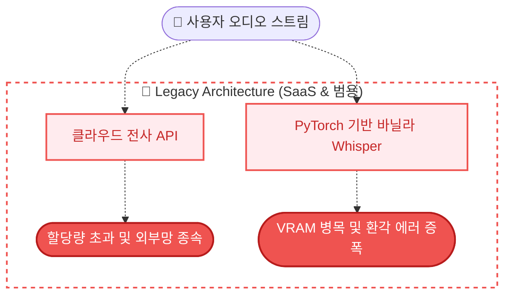
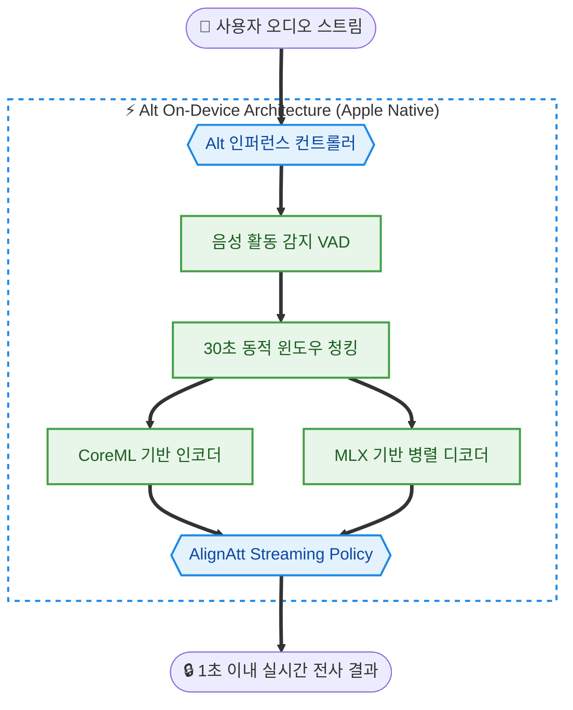

> **TL;DR (요약 로그)**
> 
> * 기업의 SaaS(Clova Note 등)의 API 할당량 제한과 네트워크 종속성을 탈피하기 위해 오프라인 기반의 온디바이스 전사 환경 구축을 진행했습니다.
> * OpenAI의 원본 Whisper 모델에서 발생하는 '무음 구간 이후 이전 문장이 반복 생성되는 현상(Hallucination)'을 장시간 전사 환경에서 반복적으로 나타나는 주요 문제로 식별했습니다.
> * KAIST 출신 엔지니어 팀이 최적화한 `Alt`의 Lightning-SimulWhisper 엔진(MLX/CoreML 타겟팅)과 VAD 기반 동적 청킹이 적용된 Alt 앱을 이용해, 격리된 안정적인 로컬 전사 환경을 구축했습니다.
{: .prompt-info }

<br>

```bash
root@hwaserbit:~# check_system_dependency --target transcription_pipeline
[INFO] Legacy Target: SaaS Cloud API (Status: Quota Exceeded, High Vendor Lock-in)
[INFO] Local Target: Vanilla Whisper (Status: PyTorch VRAM Overhead, Hallucination Detected)
root@hwaserbit:~# deploy_edge_inference --engine Alt --framework MLX --offline true
[SUCCESS] Lightning-SimulWhisper core initialized on Apple Silicon Native API.
```

## 1. 개요: SaaS 종속성의 한계와 엣지 컴퓨팅의 필요성

기업의 SaaS(Software as a Service)나 클라우드 API에 인프라의 핵심 기능을 위임하는 것은 초기 구축 비용을 줄일 수 있으나, 시스템의 장기적인 통제권을 상실하는 결과를 초래합니다. 기존 시장을 점유하고 있는 네이버 클로바 노트(Clova Note) 등의 AI 미팅 노트 서비스는 대부분 클라우드 서버에서 연산을 수행하며, 이는 월 단위의 엄격한 사용량 제한(Quota)과 민감한 음성 데이터의 외부망 유출 리스크(Attack Surface)를 동반합니다. 

실제로 600분의 할당량을 초과한 후 모바일 앱 녹음을 강제받거나, 서버 큐(Queue) 대기로 인해 최대 24시간의 변환 지연 시간이 발생하는 예측 불가능한 병목을 경험했습니다. 갤럭시 S24 Ultra와 같은 최신 안드로이드 플래그십의 온디바이스 변환 기능 역시 대안으로 검토했으나, 삼성 기본 녹음 앱은 텍스트 변환 시 백그라운드 작업을 지원하지만, 실제 프로세스 제어에는 치명적인 문제가 존재합니다. 작업 완료 시 알림을 주지 않고 앱을 포그라운드로 다시 실행해야만 상태가 동기화되는 오류를 확인했습니다. 이는 백그라운드 작업의 생명주기(Lifecycle) 관리가 비정상적임을 의미하며, 전반적인 시스템 완성도에 심각한 의문을 제기하게 만듭니다.

이러한 제한된 환경을 극복하기 위해 [altalt.io](https://www.altalt.io/ko/)(Alt) 프로젝트를 인프라에 도입했습니다. KAIST 출신 엔지니어 팀이 주도하여 개발한 이 프로젝트는 **핵심 인퍼런스 연산을 외부 인터넷 연결 없이 사용자 디바이스 내부의 연산 자원만을 활용하여 수행**하는 온디바이스(On-Device) 로컬 AI 전사(ASR) 및 요약 파이프라인입니다. 이는 외부 플랫폼에 기생하지 않고 완벽하게 독립된 데이터 플레인(Data Plane)을 구축하려는 인프라 엔지니어링의 지향점과 정확히 일치합니다.

---

## 2. 문제 상황: 로컬 추론 환경의 구조적 한계와 오버헤드

독자적인 통제권을 위해 오픈소스인 OpenAI의 원본 Whisper 모델을 일반적인 음성파일을 이용할 수 있도록 개량한 로컬 컨테이너 및 Windows Easy Whisper UI 환경에 배포하여 프로파일링을 진행한 결과, 두 가지 치명적인 아키텍처 결함을 발견했습니다.

### 2.1 오픈소스 Whisper의 치명적 결함: 환각(Hallucination)
1시간 이상의 긴 음성 데이터를 처리할 때, 화자의 발화가 멈추는 무음(Silence) 구간을 만나면 인퍼런스 엔진이 이전의 컨텍스트를 비정상적으로 반복 출력하는 에러가 발생합니다. 특정 확률 분포에 고착화되어 이전 문장을 무한 반복하는 이 현상이 발생하면, 그 이후 입력에 대한 인식 품질이 급격히 저하되며, 정상적인 전사가 어려워지는 현상이 발생했습니다.

### 2.2 무거운 의존성과 하드웨어 스로틀링(Throttling)
자체적인 로컬 AI 환경을 구축할 때 가장 큰 허들은 베이스 모델의 무거운 의존성입니다. Whisper를 로컬 디바이스에 배포할 경우 범용 프레임워크(PyTorch) 기반 구현에서는 추가적인 메모리 및 런타임 오버헤드가 발생합니다. 특히 2~3시간 이상 진행되는 강의나 원격 회의(Zoom, Google Meet) 환경에서 CPU/GPU 리소스를 지속적으로 풀 로드(Full Load)하는 것은 랩톱이나 태블릿의 배터리 환경에서 치명적입니다. 

> **Architecture Bottleneck**
> 기존의 단순 포팅(Porting) 방식으로는 "높은 정확도를 지닌 실시간 전사"와 "안정적인 하드웨어 전성비"라는 두 가지 목표를 동시에 달성할 수 없는 명확한 한계가 존재했습니다.
{: .prompt-warning }

---

## 3. 해결 과정: Alt 시스템 아키텍처 도입 및 구조 분석

단순히 오픈소스 모델을 UI로 래핑(Wrapping)하는 수준의 프로젝트들은 앞서 언급한 한계를 그대로 내포합니다. 하지만 Alt는 프론트엔드의 수려한 UI 완성도가 대변하듯, 기존 Whisper 계열을 기반으로, 온디바이스 환경에 맞게 최적화 및 재구성된 구조를 갖춘 것으로 확인되었습니다.

### 3.1 동적 청킹(Dynamic Chunking)을 통한 환각 억제
Alt는 Whisper의 환각 문제를 구조적으로 차단하기 위해 오디오 스트림을 통째로 입력하지 않고 **실시간 동적 분할** 방식을 채택했습니다.
VAD(Voice Activity Detection) 센서를 통해 화자의 발화와 무음을 분리하고, 발화 기준 약 30초 단위로 오디오 버퍼를 논리적으로 분할합니다. 특히 기계적인 시간 분할이 아닌, 화자의 말이 끝나는 시점(Pause)을 대기하여 문맥의 단절 없이 청크를 생성합니다. 이를 통해 특정 청크에서 에러가 발생하더라도 다음 30초 단위의 독립된 컨텍스트로 에러가 전이되는 것을 완벽히 격리(Isolation)했습니다.

### 3.2 Lightning-SimulWhisper 코어 엔진의 핵심 매커니즘
가장 인상적이었던 부분은 하드웨어 오버헤드를 극복한 **Lightning-SimulWhisper** 엔진의 구조적 강점입니다.

1. **Zero PyTorch 의존성 및 Native API 활용:** Alt 시스템은 무거운 범용 프레임워크인 PyTorch를 파이프라인에서 완전히 배제(Decoupling)했습니다. 대신 Apple Silicon 인프라에 최적화된 **MLX(Apple의 Machine Learning Framework)**와 **CoreML**을 직접 타겟팅했습니다. 이는 아키텍쳐에 최적화된 네이티브 실행 경로를 이용했음을 파악할 수 있습니다.

2. **하이브리드 엔진과 AlignAtt 정책 도입:** 단방향의 배치(Batch) 처리 방식이 아닌, 실시간 스트리밍 음성 인식을 위해 **AlignAtt (Alignment Attention) Policy**를 적용했습니다. VAD를 거친 마이크로 오디오 스트림은 즉시 병렬 처리 레이어로 전달됩니다.

결과적으로 공식 리포지토리 기준으로 인코딩 및 디코딩 단계에서 유의미한 성능 향상이 보고되어 있으며, 실제 테스트 환경에서도 체감 가능한 개선을 확인했습니다. M 시리즈 칩셋이 탑재된 iPad Pro 환경에서 동시 필기와 전사를 진행했을 때, 디바이스의 NPU를 적극 활용하여 예측 범주 내의 합리적인 전성비를 확보함을 직접 검증했습니다.

A. Legacy Architecture



B. Alt On-Device Architecture



---

## 4. 환경 격리와 네트워크 무결성 보호

시스템 관점에서 볼 때, 이 아키텍처의 가장 큰 이점은 핵심 데이터 플레인이 네트워크 연결 없이도 완전히 독립적으로 동작하는 온디바이스 처리(offline-capable)를 지원합니다.
{: data-toc-skip='' .mt-4 }

오디오 전사와 텍스트 요약 과정에서 외부 API 호출이 전혀 발생하지 않으므로, 인프라 내부의 Ingress 트래픽 라우팅이나 mDNS 차단 등 엄격한 로컬 네트워크 정책에 어떠한 간섭도 받지 않습니다. 네트워크 단절(Flapping)이나 지연 시간이 발생하는 상황에서도 인퍼런스 프로세스는 디바이스 내부의 샌드박스(`/var/mobile/Containers`{: .filepath})에서 무중단으로 유지됩니다. 

온디바이스 연산으로 인해 2시간 만에 제가 사용하는 아이패드 모델의 배터리의 70%가 소모되는 극심한 리소스 점유가 발생하지만, 이는 외부망 유출 리스크와 600분의 클라우드 할당량 제한을 탈피하기 위해 지불할 가치가 있는 합리적인 트레이드오프(Trade-off)로 판단했습니다.

이는 Zero-Trust 보안 모델을 지향하는 현 인프라 설계 기조에서, 절대 외부로 유출되어서는 안 되는 민감한 회의 데이터나 관리자 권한의 시스템 로그 내역을 음성으로 다룰 때 가장 강력한 보안 설계(Security by Design) 원칙으로 작용합니다. 앱 구동을 위한 최소한의 컨트롤 플레인(버전 체크 등)을 제외하고, 모든 지적 자산이 물리적 디바이스 밖을 벗어나지 않도록 통제권을 확보했습니다.

---

## 5. 결론

시스템 아키텍처의 본질은 무한한 자원 투입이 아니라, 한정된 환경 내에서의 완벽한 통제력 확보에 있습니다. Whisper의 근본적 결함을 동적 청킹과 Native API 타겟팅으로 돌파한 Alt의 설계는, 무분별한 클라우드 의존을 배제하고 엣지(Edge) 환경에서 엔지니어가 취해야 할 시스템 최적화의 정수를 보여줍니다.

향후 인프라 설계에 있어서도 단편적인 거대 모델의 맹목적인 스케일업(Scale-up)을 배제하고, 데이터의 물리적/논리적 격리성(Isolation) 확보와 코어 엔진의 디커플링(Decoupling) 최적화에 시스템 자원과 설계의 무게 중심을 둘 계획입니다.

<br>

```bash
root@hwaserbit:~# uptime -p
up 6 day, 23 hours, 53 minutes
root@hwaserbit:~# reboot
```

