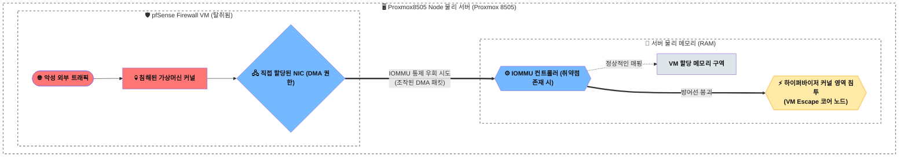

> **TL;DR (요약 로그)**
> 
> 1. 가상머신에 NIC를 직접 할당하는 **PCIe 패스스루(Passthrough)**는 성능적 이점이 뛰어나나, 장치의 **DMA(Direct Memory Access)** 기능을 VM이 직접 제어하게 되므로 하드웨어 기반 격리 메커니즘(IOMMU)에 대한 의존도가 높아집니다.
> 2. **IOMMU**의 설정 오류나 펌웨어/하드웨어 취약점이 존재할 경우, 공격에 탈취된 VM이 DMA를 악용하여 호스트 메모리 영역에 접근을 시도하는 **VM 이스케이프(Escape)** 시나리오가 이론적으로 가능합니다. (NIST SP 800-125A Rev. 1 참조)
> 3. 엔터프라이즈 환경에서는 **SR-IOV**와 같은 기술을 통해 장치 제어 권한(PF)은 하이퍼바이저가 유지하고, VM에는 제한된 기능의 VF만을 할당함으로써 패스스루 대비 더 세분화된 제어 구조를 구성합니다. 다만 이 역시 DMA-capable 구조이므로, **IOMMU 기반 메모리 보호가 필수적으로 전제됩니다.**
{: .prompt-info }

<br>

```bash
root@hwaserbit:~# dmesg | grep -i iommu && lspci -nn | grep -i ethernet
[    0.023451] DMAR: IOMMU enabled
[    0.104230] DMAR: Intel-IOMMU: used 0 non-identity map
02:00.0 Ethernet controller [0200]: Intel Corporation Ethernet Controller I225-V [8086:15f3] (rev 03)
```
{: .nolineno }

## 개요 (Background)

현재 운영 중인 인프라의 핵심 관문인 **Proxmox8505 Node (네트워크/보안 게이트웨이)**는 Proxmox(Intel Pentium Gold 8505) 환경 위에서 동작합니다. 초창기 아키텍처 설계 당시, 제로 트러스트(Zero-Trust) 관점에서 외부망(WAN) 트래픽이 호스트 OS를 거치지 않도록 방화벽 VM(pfSense)에 네트워크 카드(NIC)를 **PCIe 패스스루(Passthrough)** 방식으로 직결했습니다. 내부망(LAN)은 유연성을 위해 Linux Bridge와 VirtIO를 결합한 하이브리드 구성을 채택했습니다. 

당시에는 단순한 논리적 가상 스위치를 배제하고 하드웨어를 직접 VM에 매핑했기 때문에, 호스트 하이퍼바이저와 외부망이 **물리적으로 분리된 것과 유사한 수준의 격리 효과를 제공한다고 판단했습니다.**

하지만 이후 엔터프라이즈 인프라 아키텍처와 관련 보안 권고안을 분석하는 과정에서, 이러한 구조가 실제로는 DMA 경로를 통해 하드웨어 기반 격리에 의존하는 형태이며, 특정 조건에서는 하이퍼바이저까지 영향을 줄 수 있는 공격 벡터가 존재함을 확인하게 되었습니다.

본 포스팅에서는 단일 노드 기반 가상화 환경에서 PCIe 패스스루가 가지는 이러한 구조적 한계와, 이를 보완하기 위한 엔터프라이즈 아키텍처 관점의 접근 방식을 정리합니다.

---

## 문제 상황: 패스스루의 물리적 분리의 착각과 보안 권고 (Issue)

"NIC 패스스루는 정말로 하이퍼바이저를 안전하게 보호하는가?"라는 의문을 파고들기 위해 미국 국립표준기술연구소(NIST)의 하이퍼바이저 보안 권고안인 `NIST SP 800-125A Rev. 1` 문서를 분석했습니다. 

결론부터 명시하자면, 패스스루 환경은 외부 공격으로부터 하이퍼바이저에 대한 **'완벽한 면역'**을 보장하지 않습니다. 오히려 특정 상황에서는 장치가 가진 강력한 하드웨어 접근 권한이 하이퍼바이저 전체를 붕괴시키는 공격 벡터(Attack Vector)로 작용할 수 있음이 확인되었습니다.

> 해당 NIST 권고안의 **Section 5.2 (Threats to Device Virtualization)** 에서는 패스스루 환경에서 발생할 수 있는 DMA(Direct Memory Access) 기반의 위협과, 이를 통한 **VM 이스케이프(Escape)** 공격의 메커니즘을 명확히 경고하고 있습니다.
{: .prompt-warning }

---

## 아키텍처 분석 및 해결 과정 (Process)

### 패스스루와 DMA의 강력한 권한

가상화 환경에서 NIC를 VM에 직접 할당하면, 시스템은 성능 극대화를 위해 CPU의 개입 없이 장치가 물리 메모리에 직접 데이터를 읽고 쓸 수 있는 **DMA(Direct Memory Access)** 권한을 활성화합니다. 호스트 운영체제의 네트워크 스택(Network Stack)을 거치지 않으므로 트래픽 처리의 오버헤드는 0에 수렴하게 됩니다.

하지만 보안 관점에서 이는 양날의 검입니다. DMA 권한이 활성화되었다는 것은 곧 해당 장치는 VM에서 직접 제어되며 DMA 요청을 생성할 수 있는 권한을 갖게 됩니다.
이로 인해 하이퍼바이저의 중재가 줄어들고, IOMMU 설정 및 하드웨어 격리에 대한 의존도가 높아집니다.

### 최후의 방어선: IOMMU를 통한 하드웨어 격리

개별 VM으로 넘어간 DMA 통제권이 악용되는 것을 막기 위해, x86 아키텍처는 **IOMMU (Input-Output Memory Management Unit)**, 즉 Intel의 경우 `VT-d` 기술을 하드웨어 안전장치로 제공합니다.

IOMMU는 장치가 발생시키는 모든 DMA 요청을 중간에서 가로챕니다. 그리고 해당 VM에게만 논리적으로 허용된 격리된 메모리 구역으로만 물리 주소를 재매핑(Remapping)합니다. 만약 VM의 통제를 받는 NIC가 허락되지 않은 호스트의 메모리 구역(예: 하이퍼바이저 커널 공간)에 접근을 시도하면, IOMMU가 이를 즉각 차단하고 오류 이벤트를 발생시킵니다. 시스템 아키텍트는 이 `VT-d` 기술을 맹신하여 패스스루가 안전하다고 판단하기 쉽습니다.

### 방어선의 붕괴: VM 이스케이프 (Escape) 공격

문제는 소프트웨어와 펌웨어의 무결성이 붕괴될 때 발생합니다. 외부망에 직접 노출된 방화벽 VM에 제로데이(Zero-day) 취약점이 발생하여 해커에게 루트 권한을 탈취당했다고 가정해 보겠습니다. 

설상가상으로 메인보드의 IOMMU 펌웨어나 칩셋 레벨에 미처 패치되지 않은 버그(예: DMA 재매핑 오류)가 존재한다면 최악의 시나리오가 전개됩니다.



1. 공격자는 탈취한 VM 내에서 조작된 NIC 드라이버를 로드합니다.
2. 악의적인 DMA 읽기/쓰기 요청을 IOMMU 컨트롤러로 보냅니다.
3. IOMMU 펌웨어의 취약점을 파고들어 접근 통제를 우회합니다.
4. 결국 VM 내부의 코드가 호스트 하이퍼바이저가 사용하는 메모리 영역을 직접 덮어쓰게 됩니다.

이처럼 하드웨어 권한을 매개로 논리적으로 격리된 가상머신 경계를 뚫고, 물리적 시스템 전체의 루트 권한을 탈취하는 아키텍처 붕괴를 **VM 이스케이프(Escape)** 라고 명명합니다.

### SR-IOV 기반 장치 가상화 구조{: data-toc-skip='' .mt-4 }

NIST 보안 권고안은 하드웨어 레벨의 근본적인 위협을 방어하기 위한 대안으로, 단일 장치의 제어권을 통째로 넘기는 패스스루 대신 **SR-IOV (Single Root I/O Virtualization)** 기술의 도입을 제시하고 있습니다.

SR-IOV는 하나의 물리적 PCIe 장치를 하이퍼바이저가 완전히 통제하는 최고 제어권 영역인 **PF (Physical Function)**와, 각각의 가상머신에 할당할 수 있는 여러 개의 **VF (Virtual Function)**로 분리합니다.
* 장치의 전역 설정과 하드웨어 통제는 하이퍼바이저 공간에 남은 PF가 전담합니다.
* VM에게는 DMA 통로만 열려 있는 경량화된 VF만을 넘겨줍니다.

이 구조를 채택하면 장치의 전역 제어 권한은 PF를 통해 하이퍼바이저에 유지되고, VM에는 제한된 기능의 VF만이 노출됩니다. 이로 인해 패스스루 대비 장치 접근 범위가 제한되며, 원론적으로는 성능(가상화 오버헤드 감소)과 보안(격리 수준 향상)이라는 두 가지 목표를 함께 추구할 수 있습니다.

다만, 이는 보안 문서상에서 제시하는 이상적인 아키텍처 대안일 뿐, 실제 현업 엔터프라이즈 환경에서 SR-IOV가 NIC 패스스루를 대체하는 표준적인 인프라 구성으로 얼마나 활발히 채택되어 운영 중인지에 대해서는 실증적인 분석이 추가로 필요합니다. 향후 대규모 데이터센터의 네트워크 설계 사례와 벤더사의 실제 운영 데이터를 심도 있게 추적하여, 해당 아키텍처가 지닌 현실적인 한계와 트레이드오프(Trade-off)를 검증하며 인프라 엔지니어로서의 아키텍처 시야를 지속적으로 넓혀갈 계획입니다.

> **💡 설계 핵심 포인트**
> 모든 인프라 구성 시 시스템의 뼈대(물리 자원 제어권)는 반드시 **Host OS**가 쥐고 있어야 합니다. 제어권의 위임은 곧 공격 표면(Attack Surface)의 기하급수적인 확장을 의미합니다.
{: .prompt-tip }

---
## 결론 및 향후 로드맵 (Conclusion): 오버엔지니어링의 경계

분석 결과, 현재 `Proxmox8505 Node`에 적용된 PCIe 패스스루 아키텍처는 논리적 격리의 한계를 가지며 IOMMU 취약점 노출 시 하이퍼바이저를 보호할 수 없는 구조적 리스크를 안고 있습니다. 하지만 인프라 아키텍트로서 현실적인 위협 모델링(Threat Modeling) 관점에서 이를 재평가할 필요가 있습니다.

패스스루 환경에서 앞서 언급한 VM 이스케이프(Escape) 공격이 최종적으로 성공하려면, 다음 두 가지 치명적인 전제 조건이 동시에 충족되어야만 합니다.
1. 엔터프라이즈급 방화벽 솔루션인 pfSense 자체에 심각한 보안 결함이 발생하여 관리자 권한(root)이 외부 공격자에게 완전히 탈취되어야 합니다.
2. 탈취된 환경 내에서, **제조사의 방어 패치조차 존재하지 않는 하드웨어 결함을 파고들어 호스트의 통제권을 완전히 탈취하는 악의적 타격 코드인 'IOMMU 제로데이 익스플로잇(Zero-day Exploit)'**이 성공적으로 연계되어야 합니다.

pfSense는 비교적 안정적인 운영 이력을 가진 방화벽 솔루션이지만, 인터넷에 직접 노출되는 시스템 특성상 취약점 가능성을 완전히 배제할 수는 없습니다.

현재 글에서 기술중인 시나리오(VM 탈취 → IOMMU 취약점 악용 → VM Escape)는  
- VM 내부 권한 탈취와  
- 하드웨어 또는 펌웨어 수준의 취약점 악용  
이 동시에 요구되므로, 일반적인 위협 모델에서는 발생 가능성이 낮은 고난도 공격 체인에 해당합니다.

**[최종 인프라 아키텍처 로드맵]**
따라서 이러한 극단적인 이론적 위협에 대응하기 위해, 엔터프라이즈급 서버 랜카드(Intel X520/X710 계열)와 SR-IOV를 지원하는 메인보드로 인프라를 즉시 전면 교체하는 것은 현재 위협 모델과 개인 실습 환경을 고려할 때 비용 대비 보안 효과가 제한적인 선택으로 판단했습니다.

실제 시스템 침해의 절대다수는 이러한 고도의 하드웨어 타격이 아닌, 관리자의 방화벽 룰셋 설정 오류나 불필요한 포트 개방 등 소프트웨어 계층의 인적 오류(Human Error)에서 기인합니다. 결론적으로 당장의 무리한 아키텍처 변경보다는, pfSense의 엄격한 인그레스(Ingress) 통제와 Proxmox 커널 및 BIOS 마이크로코드의 주기적인 업데이트라는 '보안의 기본'을 철저히 유지하는 방향으로 운영 방식을 재정립했습니다.

더불어, SR-IOV 기반의 하드웨어 통제권 격리는 단일 장비에 수많은 서비스가 밀집된 대규모 엔터프라이즈 프로덕션(Production) 환경에서나 필수적인 기술입니다. 현재의 홈랩 인프라 스케일에서 이를 억지로 구현하기 위해 운영 복잡도를 높이는 것은 비효율적입니다. 

오히려 진정한 의미의 완벽한 보안과 물리적 격리가 요구되는 고도화 시점이 온다면, 복잡한 가상화 기술에 의존하기보다는 물리적 노드를 하나 더 추가하여 방화벽 게이트웨이 전체를 전용 베어메탈(Bare-metal) 환경으로 완전히 독립(Decoupling)시키는 것이 현재의 시스템 통제력과 유지보수 난이도 측면에서 훨씬 합리적인 아키텍처적 결단일 것입니다.

### 참고 문헌 (References){: data-toc-skip='' .mt-4 }

[^1]: **[NIST SP 800-125A Rev. 1](https://nvlpubs.nist.gov/nistpubs/SpecialPublications/NIST.SP.800-125Ar1.pdf)**: Security Recommendations for Server-based Hypervisor Platforms
    * *Section 2.2.2*: 패스스루(Passthrough) 및 디바이스 중재 위협 분석
    * *Section 5.2*: DMA 위협 및 VM 이스케이프(Escape) 공격 메커니즘

<br>

```bash
root@hwaserbit:~# uptime -p
up 2 weeks, 2 days, 16 hours, 9 minutes
root@hwaserbit:~# reboot
```
{: .nolineno }

